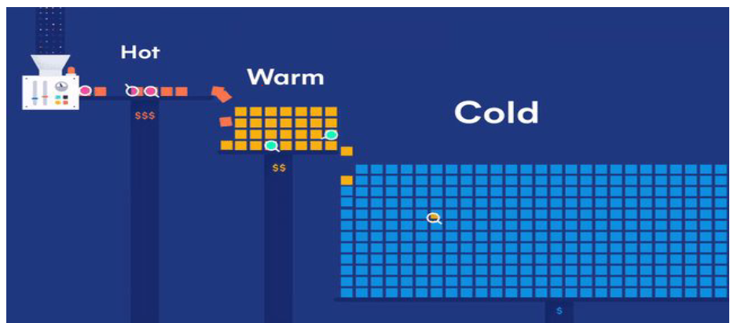
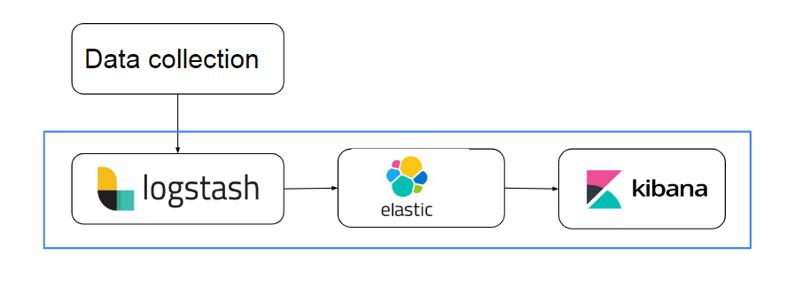
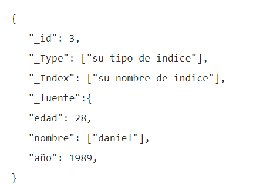
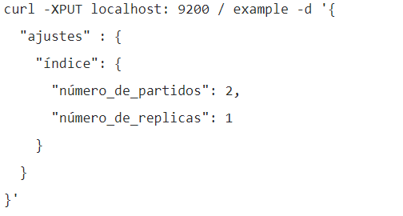
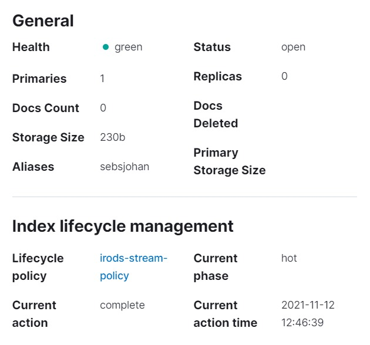
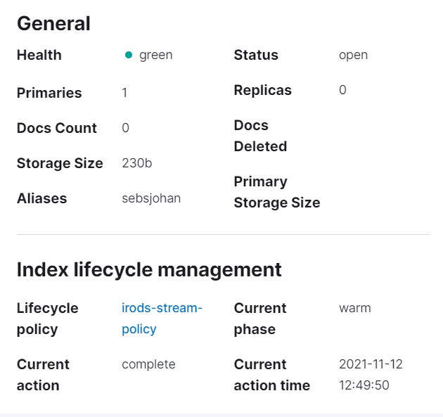
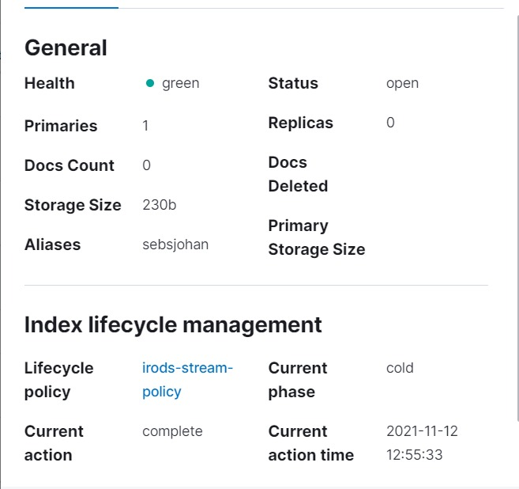
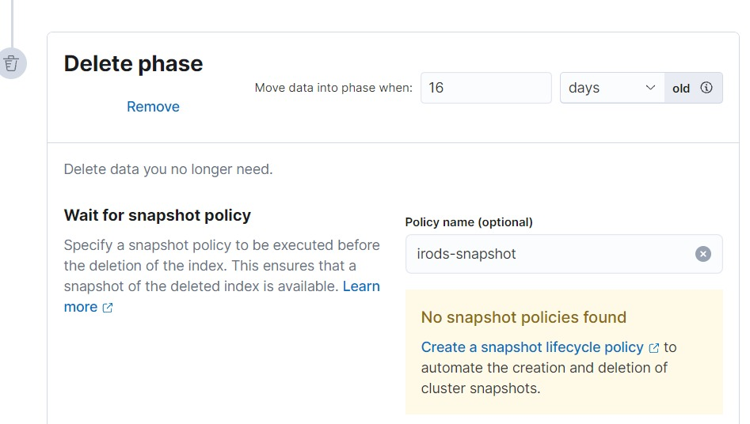

# Proyecto final TCON 2021 - 2

## Autores

- Juan Sebastian Garcia Hincapie
- Johann Cepeda Alza

## Instalación

```
git clone https://github.com/tcon2021/proyecto.git
```

## Descripción del proyecto

El proyecto final para esta materia es una arquitectura HOT-WARM-COLD implementando un sistema que lee constantemente una fuente de datos que pasan a través de las fases Hot, warm, cold. Usa politicas para el ciclo de vida de los datos que permiten definir la duracion y otros aspectos importantes a tener en cuenta. Implementa un sistemas de indexacion de datos a traves de todo un proceso desde su lectura hasta su publicación.



## Terminología y definiciones



### Logstash

Logstash es un pipeline de procesamiento de datos que funciona del lado del servidor y que ingesta datos de una multitud de fuentes, los transforma y luego los envía a un sistema de almacenamiento definido.

### Elastic

Elasticsearch es un motor de analítica y análisis distribuido, abierto para todos los tipos de datos, incluidos textuales, numéricos, geoespaciales, estructurados y no estructurados. Conocido por sus API REST simples, naturaleza distribuida, velocidad y escalabilidad, Elasticsearch es el componente principal del Elastic Stack.

### Kibana

Kibana es una aplicación de frontend gratuita y abierta que se encuentra sobre el Elastic Stack y proporciona capacidades de visualización de datos y de búsqueda para los datos indexados en Elasticsearch. Comúnmente conocida como la herramienta de representación para el Elastic Stack. Kibana también actúa como la interfaz de usuario para monitorear, gestionar y asegurar un cluster del Elastic Stack; además de como concentrador centralizado de las soluciones integradas desarrolladas en el Elastic Stack.

### Elastic - Documentos

Los documentos son objetos JSON que se almacenan dentro de un índice de Elasticsearch y se consideran la unidad base de almacenamiento. En el mundo de las bases de datos relacionales, los documentos se pueden comparar con una fila en una tabla.



### Elastic - Indices

Los índices, la unidad de datos más grande en Elasticsearch, son particiones lógicas de documentos y se pueden comparar con una base de datos en el mundo de las bases de datos relacionales

### Elastic - Fragmentos

En pocas palabras, los fragmentos son un único índice de Lucene. Son los componentes básicos de Elasticsearch y lo que facilitan su escalabilidad.

El tamaño del índice es una causa común de fallas de Elasticsearch. Dado que no hay límite para la cantidad de documentos que puede almacenar en cada índice, un índice puede ocupar una cantidad de espacio en disco que exceda los límites del servidor de alojamiento. Tan pronto como un índice se acerque a este límite, la indexación comenzará a fallar.



## Arquitectura HOT - WARM - COLD

### ETAPA HOT

Cuando hablamos de acceso a datos “Hot Storage”, nos estamos refiriendo a datos casi basados en memoria computacional, de unas necesidades inmediatas de acceso y, en muchas ocasiones, pre-configurados con anterioridad, guardando el cálculo, agregación, transformación que facilitan tanto el acceso como el servicio al mismo.



### ETAPA WARM

Por lo que refiere a un acceso a los datos más intermédio, o “Warm Storage”, estaríamos hablando de sistemas de Datawarehousing. Estamos hablando de tener datos ya anteriormente trabajados y que tienen una función concreta, sea para reporting, sea para cumplir con un requerimiento de negocio para un acceso operacional desde una aplicación.



### ETAPA COLD

El uso de un repositorio basado en “Cold Storage” podría ser cuando usamos una arquitectura de datos basada en Data-Lake, es decir, nuestro acceso a los datos no es operacional ni tampoco constante. Más bien para sistemas de reporting, agregaciones o transformaciones de datos de procesos basados en colas, entonces, tenemos un acceso continuado al sistema.


## Indices
Presentamos los indices


## Creación y borrado de los respaldos


